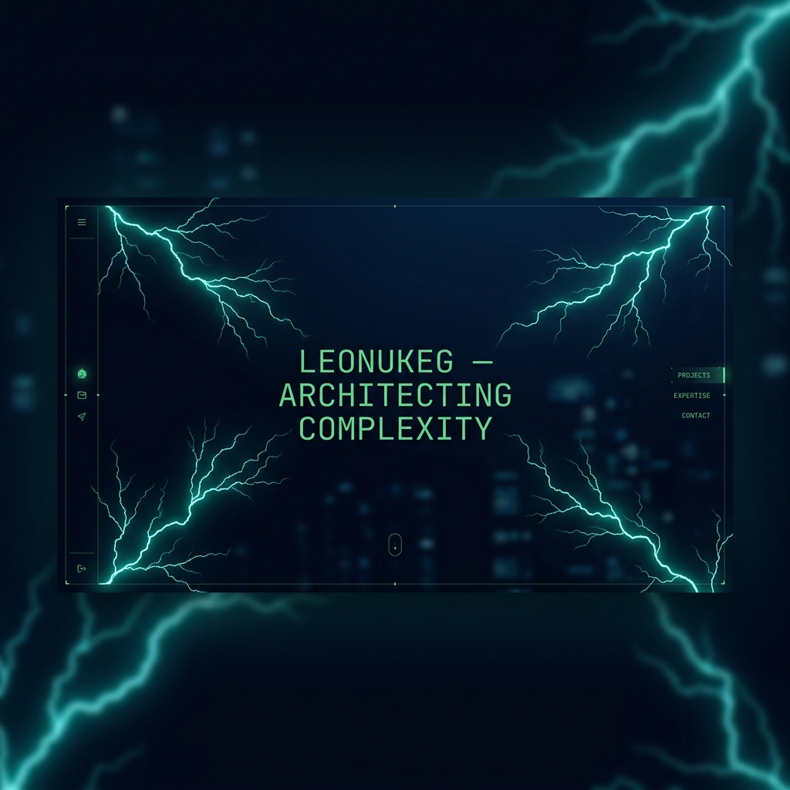

# LEONUKEG v2 — Reflex Edition



This is the full migration of the LEONUKEG portfolio from Vanilla HTML/JS to **Reflex (Python)**. 

## ⚡ Why Reflex?
- **Python-Based:** All logic, routing, and data management are handled in Python.
- **Reactive State:** Built-in support for global state management.
- **High Performance:** Still utilizes the custom JS Lightning Engine and GSAP for fluid animations.

## 🏗 Structure
- `leonukeg_v2.py`: Main application and layout.
- `data.py`: Project and experiment data layer.
- `state.py`: Reactive application state.
- `components/`: Modular UI components.
- `assets/`: Custom CSS, GSAP scripts, and the Lightning Engine.

## 🚀 How to Run
1. Install dependencies:
   ```bash
   pip install -r requirements.txt
   ```
2. Run the application:
   ```bash
   reflex run
   ```

---
*Built with Intention by Freddy León*
